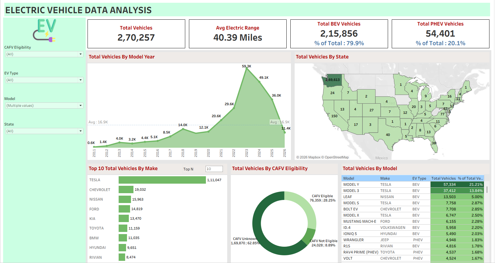

# ⚡ EV Market Analysis

An interactive Tableau dashboard analyzing **270,257 electric vehicle registrations** to understand EV adoption trends, market share by manufacturer, and geographic distribution across the United States.


---

## 📌 Overview

This project analyzes a state-level electric vehicle population dataset to understand how EV adoption has grown over time, which manufacturers and models dominate the market, and how eligibility for clean-fuel incentives (CAFV) breaks down across the fleet. The dashboard gives a single view for spotting adoption trends and market leaders.

## 📊 Key Metrics

| Metric | Value |
|---|---|
| Total Vehicles | 2,70,257 |
| Average Electric Range | 40.39 miles |
| Total BEV (Battery Electric) Vehicles | 2,15,856 (79.9%) |
| Total PHEV (Plug-in Hybrid) Vehicles | 54,401 (20.1%) |

## 🖼️ Dashboard Preview



## 🔍 Key Insights

- **Tesla dominates the market** with 1,11,047 registered vehicles — more than 5x the next closest manufacturer (Chevrolet, 19,032).
- **Model Y and Model 3** are the two best-selling individual models, together accounting for over 35% of all registered vehicles.
- **EV adoption accelerated sharply from 2020 onward**, peaking at 59.3K registrations in the most recent full year before the most recent (partial/incomplete) year shows a drop-off.
- **Battery Electric Vehicles (BEV) make up ~80%** of the fleet, with Plug-in Hybrids (PHEV) at roughly 20%.
- **CAFV eligibility is mixed** — only 28.25% of vehicles are confirmed Clean Alternative Fuel Vehicle eligible, while the majority (62.85%) have unknown eligibility status, pointing to a data/verification gap rather than actual ineligibility.
- Registrations are **heavily concentrated geographically**, with one state accounting for the vast majority of the dataset (consistent with this being state-sourced registration data).

## 🎛️ Interactive Features

The Tableau dashboard supports filtering by:
- CAFV Eligibility
- EV Type (BEV / PHEV)
- Model
- State
- Adjustable "Top N" control for the manufacturer ranking

## 🛠️ Tech Stack

| Tool | Purpose |
|---|---|
| **Tableau** | Dashboard design and interactive visualization |

## 📁 Repository Structure

```
EV-Market-Analysis/
├── data/
│   └── electric_vehicle_population_data.csv.gz   # Raw EV registration dataset (270,257 rows, 17 columns, gzip-compressed)
├── tableau/
│   └── ev_market_analysis.twb                     # Tableau workbook
├── assets/
│   └── screenshots/                                # Dashboard preview image(s)
└── README.md
```

## 🗂️ Dataset

`data/electric_vehicle_population_data.csv.gz` (gzip-compressed to keep the repo lightweight) contains **270,257 vehicle records** with 17 fields:

`VIN (1-10)`, `County`, `City`, `State`, `Postal Code`, `Model Year`, `Make`, `Model`, `Electric Vehicle Type`, `Clean Alternative Fuel Vehicle (CAFV) Eligibility`, `Electric Range`, `Legislative District`, `DOL Vehicle ID`, `Vehicle Location`, `Electric Utility`, `2020 Census Tract`.

To use the raw CSV outside Tableau, unzip it first:
```bash
gunzip -k data/electric_vehicle_population_data.csv.gz
```

## 🚀 How to Explore This Project

1. **View the dashboard** — open `tableau/ev_market_analysis.twb` in [Tableau Desktop / Public](https://www.tableau.com/products/desktop) (free with Tableau Public) to interact with the filters yourself.
2. **No Tableau?** — just view the static screenshot in `assets/screenshots/dashboard_overview.png`.
3. **Explore the raw data** — unzip and open `data/electric_vehicle_population_data.csv.gz` in Excel or load it into pandas.

## 🛠️ Skills Demonstrated

- Data cleaning & transformation of a large (270K-row) government dataset
- Geographic (map-based) visualization
- KPI design and market-share analysis
- Interactive dashboard design in Tableau

## 🚧 Future Enhancements

- [ ] Add year-over-year growth rate calculations
- [ ] Break down adoption trends by county/city for finer geographic detail
- [ ] Add a Python (pandas) notebook for deeper exploratory analysis
- [ ] Publish the dashboard to Tableau Public for live sharing

## 📬 Connect

**Sahil Kadam**
Feel free to connect or reach out with questions/feedback about this project.

---
*If you found this project useful, consider giving it a ⭐!*
